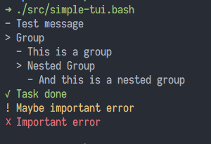

# simple-tui

Simple TUI library for Bash scripts.

## Example

```bash
tui_info 'Test message'

tui_group 'Group'
tui_info 'This is a group'

tui_group 'Nested Group'
tui_info 'And this is a nested group'
tui_group_end
tui_group_end

tui_done 'Task done'

tui_warn 'Maybe important error'
tui_error 'Important error'
```

this looks:



## Install

```bash
eval "$(curl https://raw.githubusercontent.com/sei40kr/simple-tui/master/src/simple-tui.bash)"
```
